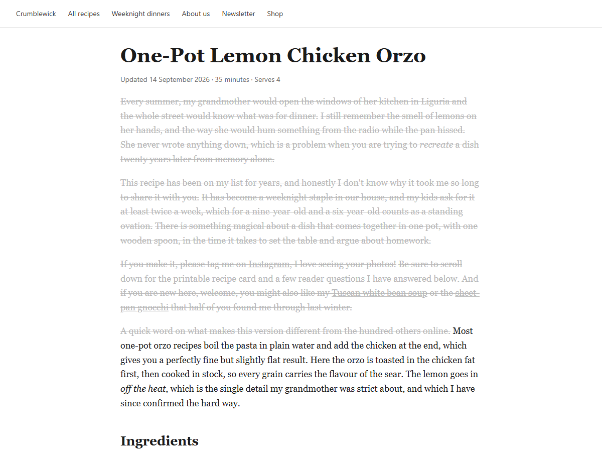
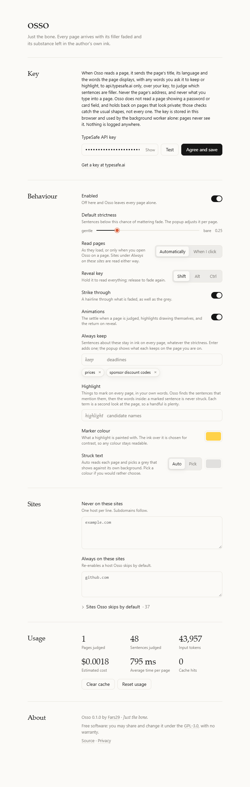

# Osso

**Solo l'osso.** Just the bones.

Every page you open arrives with its filler faded to grey and its substance left in the author's own words. Nothing is hidden, nothing is rewritten, nothing is summarised: the story is still there, in grey, right above the recipe, in ink.

How it looks:

- Hold **Shift** to peek at everything; let go and the grey comes back.
- The slider in the popup sets how strict it is, from gentle to bare.
- Type a rule like *prices* and every sentence about prices comes back to ink, on every page.

## Install

Chrome, Edge or Brave. There is no store listing yet.

1. Download a release zip and unpack it, or clone this repo and run `npm install && npm run build`.
2. Open `chrome://extensions`.
3. Turn on **Developer mode** (top right).
4. Click **Load unpacked** and pick the `dist/` folder.

Firefox: the manifest carries a `gecko` id for Firefox 128+, but it is untested there and the background worker may need to become an event page.

## Your key

Osso asks a model, [Jev](https://docs.typesafe.ai) by TypeSafe, one question per sentence, with your own key. Get one at [typesafe.ai](https://typesafe.ai). Osso opens its Options page on first install; paste the key there, press **Test**, then **Save**.

What leaves your machine, and only to `api.typesafe.ai`: the page title, its language, a page-kind hint and the main text of the page, never the URL. Cost is small: the ten pages of the [calibration run](docs/calibration.md) cost $0.0024 together, and a page you have already read is served from the cache. The key is stored in this browser only; the script that runs inside pages never sees it.

## Using it

Click the icon. The popup shows how many sentences were kept, the page kind, and the controls.

**Rules.** The field at the top of the popup is the one place you talk to the model. Type what you always want to keep, in your own words (*prices*, *deadlines*, *allergens*, *what I have to do*), press Enter, and the sentences it catches come back to ink with a brief underline. The chip shows how many it kept on this page; `×` removes it instantly. Rules apply on every page, up to 8.

**Per site.** The **On this site** switch in the popup turns Osso off for the current host; the keyboard shortcut **Alt+Shift+O** does the same. Osso is off by default where the page is your workspace rather than someone's writing: mail, docs, chat, code hosting, search, video and social feeds (the list is in Options under Sites). To use it there anyway, flip the switch on that site or add the host to *Always on these sites*.

**Hover** a grey sentence to see what it was judged to be (story, promo, opinion) and how much of it is worth keeping. **Click** a grey sentence to pin it back for this visit.

## How it decides

1. The main text of the page is split into sentences; headings, tables, code, navigation and forms are never touched.
2. Sentences go to the model in batches of about 60, in parallel, with the page's own text as context.
3. Each sentence gets a probability that it carries what the reader came for, and a kind (fact, figure, step, condition, opinion, story, filler, promo).
4. Sentences below the slider are faded: a colour change only, so nothing moves and links still work.
5. Probabilities are cached per page, so the slider and rule removal re-render instantly with no request.
6. Pages that change under you (infinite scroll, client-side navigation) are watched; only new sentences are judged.

The question, verbatim:

> Consider this sentence from the page: «S». Does this sentence itself carry practical content the reader came to this page for?
>
> **true:** Yes: the sentence states a fact, figure, date, quantity, ingredient, step, condition, cost, obligation, decision or warning that the reader needs, even if the page says it again elsewhere.
> **false:** No: the sentence is a story, memory, opinion, greeting, thanks, reassurance, navigation hint or promotion; a reader looking for the practical content would skip it.

On 99 hand-labelled sentences from ten pages in English and Italian, this question separates substance from filler with an AUC of 0.998 (mean p(keep) 0.94 for substance, 0.12 for filler), and a batch of 15–29 sentences answers in 610–1330 ms. Full numbers, per-page table and the redundancy trap in [docs/calibration.md](docs/calibration.md); the design in [docs/design/](docs/design/).

## Honest limits

- It is a judgment, not a guarantee. The model will sometimes grey a sentence you needed. Grey text is still there, still readable and selectable; hold Shift when it matters.
- Pages built from `div`s or unusual markup, and pages with fewer than 8 sentences of main text, may be skipped. The popup says why.
- It never runs in editors, mail, chat, code hosting and social feeds by default, and never on a page until you have saved a key.
- The requests are made with your key; the cost is yours. The popup keeps a running total in Options under Usage.

## Development

Node 20 or newer. TypeScript strict, no frameworks, no runtime dependencies: vanilla DOM and `fetch`. The key for the live scripts goes in `.env` as `TYPESAFE_API_KEY`.

| command | what it does |
|---|---|
| `npm run build` | esbuild → `dist/` |
| `npm run dev` | build and watch |
| `npm test` | vitest, jsdom, mocked `chrome.*`; never calls the API |
| `npm run typecheck` | `tsc --noEmit` |
| `npm run calibrate` | the probe behind `docs/calibration.md`; live API, about a quarter of a cent |
| `npm run e2e` | Playwright loads `dist/` into Chromium against the live API; screenshots in `e2e/screenshots/` |
| `node --env-file=.env e2e/screens.mjs --docs` | every screen as a picture; `--docs` refreshes `docs/screenshots/` |
| `npm run icons` | `icons/icon.svg` → the PNG sizes |
| `npm run zip` | `dist/` → `release/osso-<version>.zip` |

Layout: `src/shared/` (types and constants, the contracts), `src/content/` (segment, render, orchestrator: runs inside the page), `src/background/` (settings, cache, api: the only code that holds the key), `src/packs/` (page kinds), `src/ui/` (popup and options), `test/`, `e2e/`, `scripts/`.

Page kinds live in `src/packs/`, one file each. A pack is an id, a `stateHint` sent to the model, optional one-sentence hints appended to the keep criteria, and a `match(meta)` score computed from JSON-LD, URL, `og:type`, title and a text sample. To add one: copy `recipe.ts`, add the id to `PageKind` in `src/shared/types.ts` and its label in `PAGE_KINDS`, and add the pack to `PACKS` in `src/packs/index.ts`. Routing only tunes wording; a wrong pack still gets a good answer.

## License

GPL-3.0.
