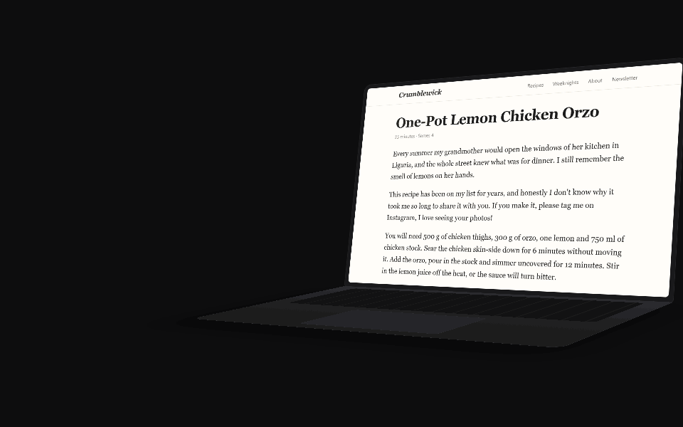
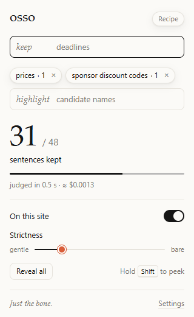
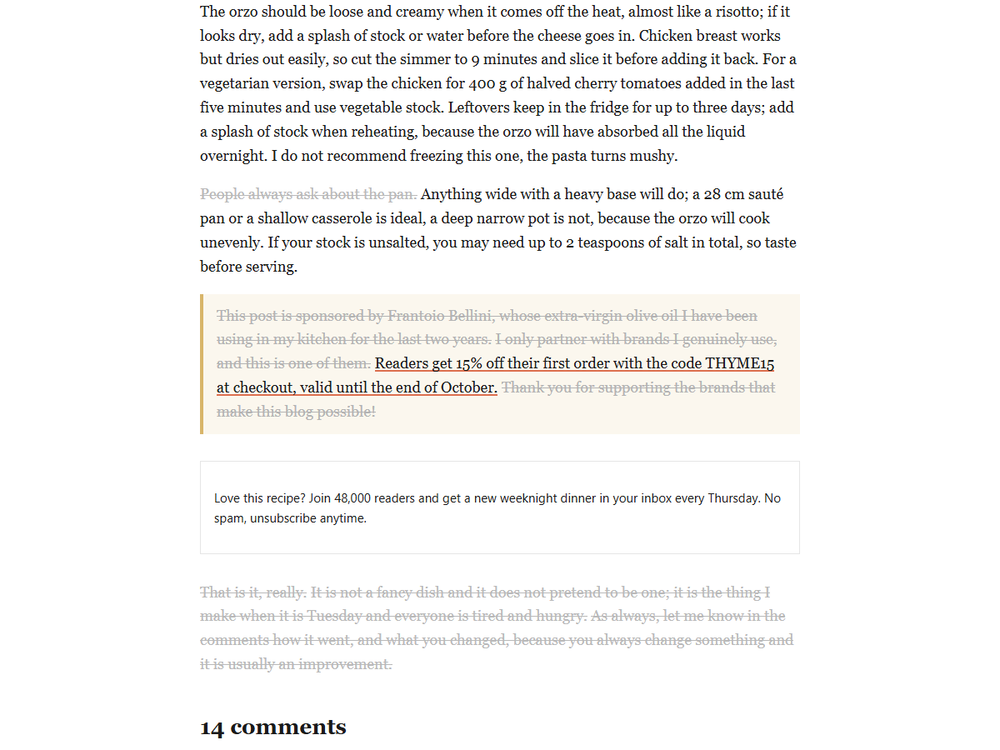

<p align="center">
  
</p>

<h1 align="center">Osso</h1>

<p align="center"><b>Just the bone.</b></p>

<p align="center">
  <a href="https://github.com/Fars29/osso/releases/latest">Download</a>
  &nbsp;·&nbsp;
  <a href="#install">Install</a>
  &nbsp;·&nbsp;
  <a href="docs/how-it-works.md">How it works</a>
  &nbsp;·&nbsp;
  <a href="PRIVACY.md">Privacy</a>
</p>

<p align="center">
  
</p>

Most of what you read online is filler. Osso is a browser extension that strikes it out, on every page, as you read, and leaves what you came for.

- ~~The life story~~ fades; **the recipe stays**.
- ~~"We value your trust"~~ fades; **"prices go up 20% on Monday" stays**.
- ~~Forty paragraphs of legalese~~ fade; **"renews automatically, no refunds" stays**.

Nothing is hidden, rewritten or summarised: the filler is still there, greyed and struck through, in the author's own words. Hold <kbd>Shift</kbd> and it all comes back.

## Why

[Jev](https://docs.typesafe.ai) is a model by TypeSafe that does not chat. You ask it a question and it answers with a yes or a no and a probability. It is fast and cheap enough to ask about *every single sentence* of a page: **"is this what the reader came for?"** A whole article answers in a second or two, for about a tenth of a cent.

So Osso asks, sentence by sentence, and strikes out the rest.

## Install

Coming to the Chrome Web Store (in review). Until then, two minutes by hand:

1. Download the [latest release](https://github.com/Fars29/osso/releases/latest) and unpack it.
2. Open `chrome://extensions`, turn on **Developer mode**, click **Load unpacked**, pick the folder.
3. On the welcome page, read what Osso sends, paste your [TypeSafe key](https://typesafe.ai) and press **Agree and save key**. Then choose when it reads: **every page as it loads**, or **only when you click**.

Built and tested for Chrome. Other Chromium browsers (Edge, Brave) should work too.

Free and open source, and it runs on a key of your own: no account with us, no server, no tracking. A page costs about $0.001 and one you have read before is free. What is sent and what never is: [PRIVACY.md](PRIVACY.md).

## Using it

| What&nbsp;you&nbsp;do | What happens |
|---|---|
| Hold <kbd>Shift</kbd> | Everything comes back to ink. |
| Hover&nbsp;a&nbsp;struck&nbsp;sentence | One word says why: *story*, *promo*, *opinion*, *boilerplate*, *aside*. |
| Click&nbsp;a&nbsp;struck&nbsp;sentence | It comes back to ink for this visit. |
| Move&nbsp;the&nbsp;slider | How strict, from gentle to bare. Instant, no new request. |
| Type&nbsp;after&nbsp;**keep** | Sentences about it always stay in ink: *prices*, *deadlines*, *allergens*. |
| Type&nbsp;after&nbsp;**highlight** | Osso marks it, in your own words: *candidate names*, *ingredients*, *consequences*. It looks for the thing, not the word: a name is marked on its own, a consequence with the part of the sentence that says it. Each mark draws itself, like a highlighter, the moment you reach it, and a marked sentence is never struck. |
| Turn&nbsp;off&nbsp;**On&nbsp;this&nbsp;site** | Osso leaves that site alone. <kbd>Alt</kbd>+<kbd>Shift</kbd>+<kbd>O</kbd> does the same. |

<p align="center">
  <picture>
    <source media="(prefers-color-scheme: dark)" srcset="docs/screenshots/popup-dark.png">
    
  </picture>
  &nbsp;&nbsp;
  
</p>

The marker's colour and the colour of struck text are both yours, in Options.

Osso stays out of the way on a list of well-known sites that are a workspace rather than someone's writing (mail, documents, chat, code, search, video, social feeds; the list is in Options), and leaves reviews and comments alone: there the opinion is the point. It does not read a page showing a password or card field, and holds back to ask first on anything that looks like the inside of an account. Those checks read how a page is built, never what it is about: an article about banks is an article. They can miss, so where the text itself is private, choose *only when you click* ([privacy](PRIVACY.md)).

## How it decides

The page's main text is split into sentences; headings, labels, data tables, code and navigation are never touched. Each sentence goes to Jev with its neighbours as context and comes back with the probability that it carries what the reader came for. Below the slider, it fades. Each batch is painted as it arrives, and what is further down waits until you scroll to it, so you watch it go.

A highlight first asks which sentences mention the thing. Something a few words name (a person, an amount, an ingredient) is then marked word by word; something a sentence states (a consequence, a reason, a risk) is marked as the sentence, or in a long one the clause, that says it. It looks for the thing, not for the word: ask for *consequences* and it marks the sentences that say what follows, on a page where that word never appears.

On 99 hand-labelled sentences in English and Italian the question separates substance from filler with an AUC of 0.998. The question itself, the numbers, and what real pages taught us: [how it works](docs/how-it-works.md) · [calibration](docs/calibration.md).

## Honest limits

- It is a judgment, not a guarantee. Sometimes it strikes a sentence you needed. It is still there and still readable: hold Shift.
- The privacy checks are heuristics. A page built unusually can get through them, and then its text is sent like any other page's. Two things do not depend on them, because no code exists to do otherwise: **the page's address is never sent, and neither is anything you type into a page.**
- Pages with very little text, or with unusual markup, may be skipped. The popup says why.
- The cost is yours, because the key is. Options keeps a running total.
- Only Chrome is tested. Forks for other browsers are welcome.

## Development

```
npm install
npm run build     # → dist/
npm test          # unit tests, never call the API
```

TypeScript, no frameworks, no runtime dependencies. Everything else (the live end-to-end run, the tools for judging the judgments on real pages, how to add a page kind, how releases are cut) is in [docs/development.md](docs/development.md).

## License

GPL-3.0, by [Fars29](https://github.com/Fars29). You can use, change and share Osso, commercially too; what you share stays under the same license and keeps the credit "Based on Osso by Fars29 on GitHub" (see [NOTICE](NOTICE)). Osso is an independent project, not affiliated with or endorsed by TypeSafe.
